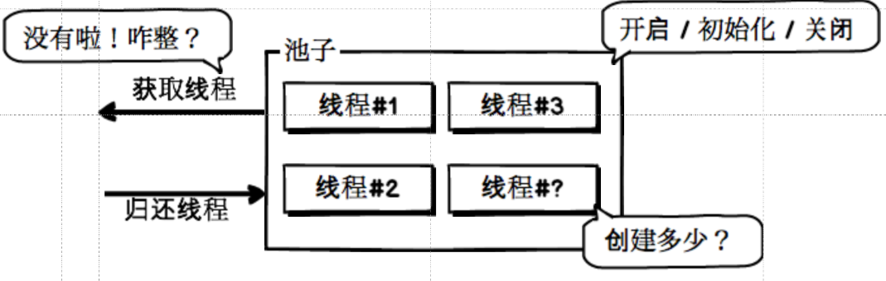
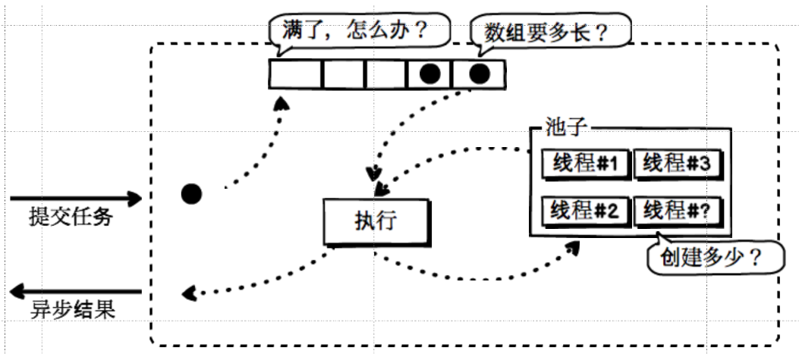
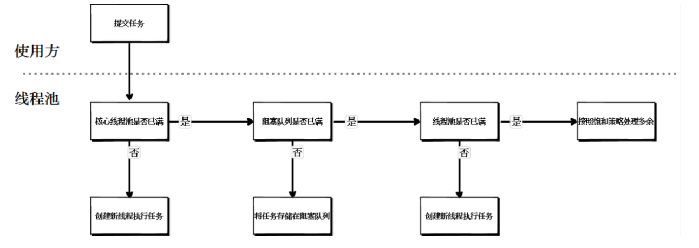
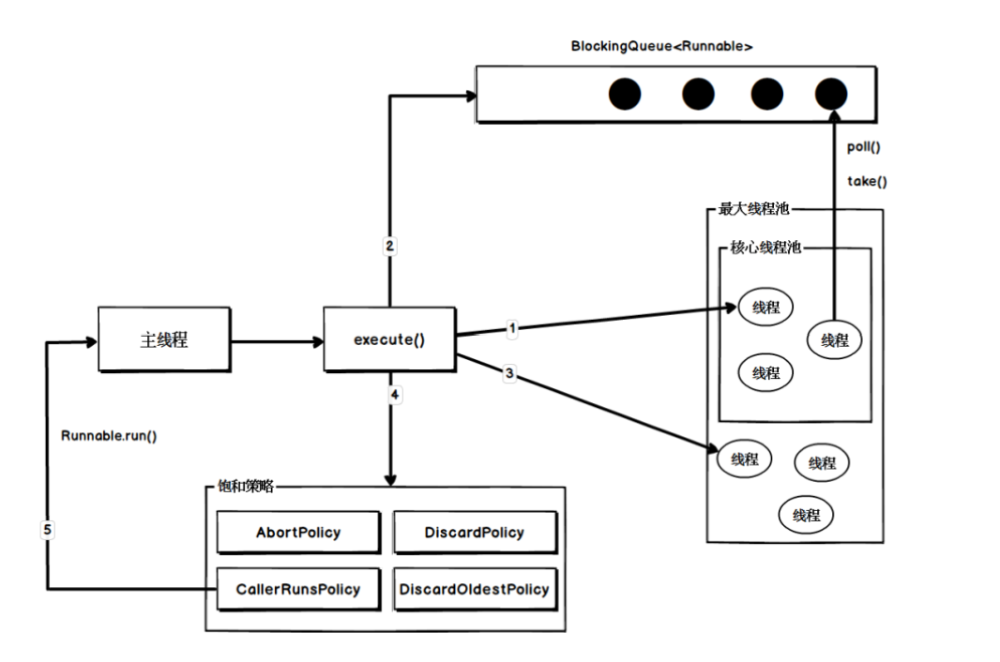
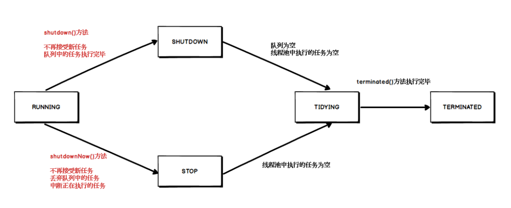

## 背景

在开发过程中，经常接触相关池化技术，如数据库连接池、线程池等，在目前来看，任何池化技术的使用都是为了简便使用方操作、减少系统资源开销等，现在让我们来接触线程池

## 新旧对比

背景概述：现在需要开发一个文档转换接口，将word文档转化为pdf，以下是旧写法

```java
   @Test
    public void oldHandle() throws InterruptedException {
        /**
         * 使用循环来模拟许多用户请求的场景，此处模拟100
         */
        for (int request = 1; request <= 100; request++) {
            new Thread(() -> {
                System.out.println("文档处理开始！");
                try {
                    // 将Word转换为PDF格式：处理时长很长的耗时过程
                    Thread.sleep(1000L * 30);
                } catch (InterruptedException e) {
                    e.printStackTrace();
                }
                System.out.println("文档处理结束！");
            }).start();
        }
        Thread.sleep(1000L * 1000);
    }
```

存在的问题：

- 每次用户请求进来时，都开启一个新线程来进行文档转化操作，当遇到业务高峰期请求量过大时，最终将导致系统超出可接收范围导致崩溃
- 需要自行创建线程来进行相关操作，每个线程开启后只使用一次，开销代价大

```java
    @Test
    public void newHandle() throws InterruptedException {
        /**
         * 开启了一个线程池：线程个数是10个
         */
        ExecutorService threadPool =
                Executors.newFixedThreadPool(10);
        /**
         * 使用循环来模拟许多用户请求的场景
         */
        for (int request = 1; request <= 100; request++) {
            threadPool.execute(() -> {
                System.out.println("文档处理开始！");

                try {
                    // 将Word转换为PDF格式：处理时长很长的耗时过程
                    Thread.sleep(1000L * 30);
                } catch (InterruptedException e) {
                    e.printStackTrace();
                }

                System.out.println("文档处理结束！");
            });
        }

        Thread.sleep(1000L * 1000);
    }
```

使用java自带线程池，提前开辟线程数量为10的线程池，当大量请求进来时，只有10个文档转化任务开启，剩余请求进入线程池缓冲队列中，等待线程池空闲，重复利用线程资源

## 简单线程池设计思路

### 版本1



- 开辟线程池，考虑线程的开启、初始化、回收等
- 考虑线程池的线程数量和超过数量时的处理方案
- 考虑外部如何获取线程和归还线程

### 版本2


- 开辟线程池，考虑线程池的线程数量和超过线程数量时放处理方案
- 引入缓冲队列，解决版本1中超出线程数量时的问题，此时需考虑超出缓冲队列限制时如何处理
- 外部如何提交任务和获取任务执行结果

总结：设计过程中要思考的问题

- 初始创建多少线程？
- 没有可用线程了怎么办？
- 缓冲数组要多长？
- 缓冲数组满了怎么办？

## java内置线程池
### 线程池的核心参数

- corePoolSize ：核心线程数
- maximumPoolSize：最大线程数
- keepAliveTime：线程存活时间
- unit：时间单位
- workQueue：缓冲对接
- threadFactory：线程工厂
- handler：线程池饱和策略

### 线程池的处理流程



### 线程池可选择的阻塞队列

- 基于数组的有界阻塞队列
- 基于链表的有界/无界阻塞队列
- 同步移交阻塞队列

```java
 @Test
    public void arrayBlockingQueue() throws InterruptedException {
        /**
         * 基于数组的有界阻塞队列，队列容量为10
         */
        ArrayBlockingQueue queue =
                new ArrayBlockingQueue<Integer>(10);

        // 循环向队列添加元素
        for (int i = 0; i < 20; i++) {
            queue.put(i);
            System.out.println("向队列中添加值：" + i);
        }
    }

    @Test
    public void linkedBlockingQueue() throws InterruptedException {
        /**
         * 基于链表的有界/无界阻塞队列，队列容量为10
         */
        LinkedBlockingQueue queue =
                new LinkedBlockingQueue<Integer>();

        // 循环向队列添加元素
        for (int i = 0; i < 20; i++) {
            queue.put(i);
            System.out.println("向队列中添加值：" + i);
        }
    }

    @Test
    public void test() throws InterruptedException {
        /**
         * 同步移交阻塞队列
         */
        SynchronousQueue queue = new SynchronousQueue<Integer>();

        // 插入值
        new Thread(() -> {
            try {
                queue.put(1);
                System.out.println("插入成功");
            } catch (InterruptedException e) {
                e.printStackTrace();
            }
        }).start();

        // 删除值
        /*
        new Thread(() -> {
            try {
                queue.take();
                System.out.println("删除成功");
            } catch (InterruptedException e) {
                e.printStackTrace();
            }
        }).start();
        */

        Thread.sleep(1000L * 60);
    }
```

### 线程池可选择的饱和策略

- AbortPolicy终止策略（默认）
- DiscardPolicy抛弃策略
- DiscardOldestPolicy抛弃旧任务策略
- CallerRunsPolicy调用者运行策略


根据上述参数的不同，常用的线程池有：

- newCachedThreadPool线程数量无限线程池
- newFixedThreadPool线程数量固定线程池
- newSingleThreadExecutor单一线程线程池

### 线程池的执行示意图



```java
@Test
    public void submitTest()
            throws ExecutionException, InterruptedException {

        // 创建线程池
        ExecutorService threadPool =
                Executors.newCachedThreadPool();

        /**
         * 利用submit方法提交任务，接收任务的返回结果
         */
        Future<Integer> future = threadPool.submit(() -> {
            Thread.sleep(1000L * 10);

            return 2 * 5;
        });

        /**
         * 阻塞方法，直到任务有返回值后，才向下执行
         */
        Integer num = future.get();

        System.out.println("执行结果：" + num);
    }

    @Test
    public void executeTest() throws InterruptedException {
        // 创建线程池
        ExecutorService threadPool =
                Executors.newCachedThreadPool();

        /**
         * 利用execute方法提交任务，没有返回结果
         */
        threadPool.execute(() -> {
            try {
                Thread.sleep(1000L * 10);
            } catch (InterruptedException e) {
                e.printStackTrace();
            }

            Integer num = 2 * 5;
            System.out.println("执行结果：" + num);
        });
        Thread.sleep(1000L * 1000);
    }
```

## 线程池的状态

五种状态:
- RUNNING
- SHUTDOWN
- STOP
- TIDYING
- TERMINATED

