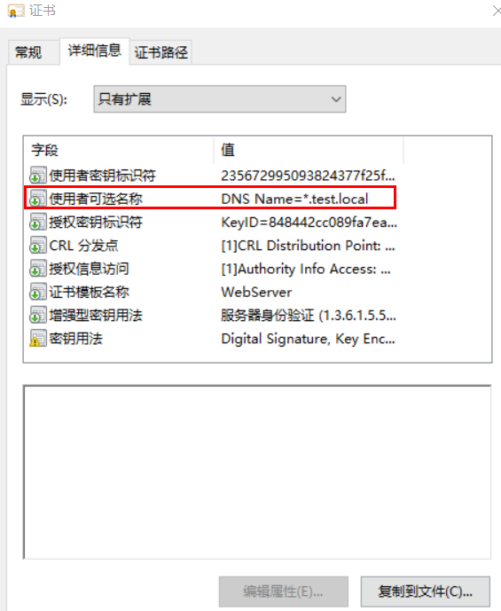

## 背景

在现有的LDAP服务上，密码校验LDAP服务器只提供明文校验，在一定程度上存在安全隐患，因此LDAPS诞生了，类似于HTTP和HTTPS在传输层进行加密并通过CA证书校验，在一定程度上解决该问题。

## 区别

### LDAP

- 账号密码明文传输，不加密
- 默认端口389
- 链接URL类似于：LDAP://ldap.test.local:389
### LDAPS

- 账号密码加密传输
- 默认端口389
- 连接URL类似于：LDAPS://ldap.test.local:636
- 使用LDAPS的服务器需安装证书，且证书有相关要求，如下图



## 使用

执行命令安装该证书到java环境

```yaml
keytool -import -alias ldap -keystore ../lib/security/cacerts -file D:\workspace\CA\ldap.cer
```

然后使用该连接URL尝试连接LDAPS:

```yaml
LDAPS://ldap.test.local:636
```