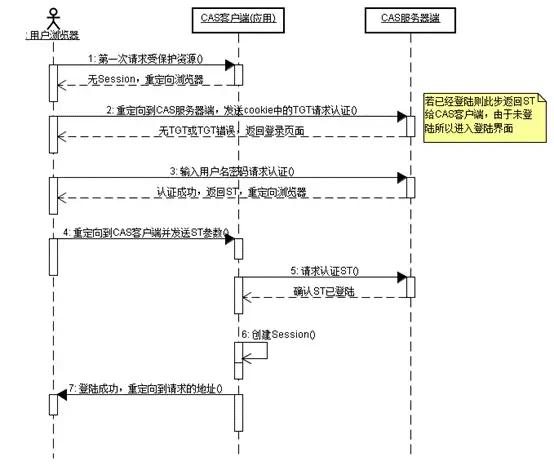

## 背景

两个单点登录中心做登录对接业务，其中客户单点登录协议为CAS，需我方按照CAS标准进行单点登录业务接入。

## 问题描述

登录时序图





- 访问服务： SSO 客户端发送请求访问应用系统提供的服务资源。
- 定向认证： SSO 客户端会重定向用户请求到 SSO 服务器。
- 用户认证：用户身份认证。
- 发放票据： SSO 服务器会产生一个随机的 Service Ticket 。
- 验证票据： SSO 服务器验证票据 Service Ticket 的合法性，验证通过后，允许客户端访问服务。
- 传输用户信息： SSO 服务器验证票据通过后，传输用户认证结果信息给客户端。

按照上述时序图，我方sso服务作为单点登录客户端接入cas server，但是在最后第五步`验证票据`的部分失败了  
抛出异常

```xml
java.lang.RuntimeException: java.io.FileNotFoundException: https://xxxx/cas/serviceValidate?ticket=ST-1-KQbkQaKgvlOZKRYwtomN-cas01.example.org&service=http%3A%2F%2F10.1.104.76%3A8089%2Fiamsso%2Flogin%3Freturn_url%3D%252Fiamsso
	at org.jasig.cas.client.util.CommonUtils.getResponseFromServer(CommonUtils.java:462)
	at org.jasig.cas.client.validation.AbstractCasProtocolUrlBasedTicketValidator.retrieveResponseFromServer(AbstractCasProtocolUrlBasedTicketValidator.java:41)
	at org.jasig.cas.client.validation.AbstractUrlBasedTicketValidator.validate(AbstractUrlBasedTicketValidator.java:193)
```

>细心的朋友会发现，此处是`cas-client`抛出的异常信息，该包属于cas-client开源工具包，排除基础业务问题

## 问题分析

在cas server验证票据的流程中主要为：
- cas client获取cas server重定向地址中的ticket参数
- 将ticket发送给`cas/serviceValidate`端点验证ticket有效性，预计在此处返回当前登录用户信息

怀疑以下两种情况：
（1）cas server在当前client部署服务器无法访问
（2）当前接口调用，在目标cas server存在业务处理异常，导致超时无法获取响应

- 经排查，该cas server改造后不支持cas v2的`cas/serviceValidate`验证端点，而是在cas v3的`cas/p3/serviceValidate`

## 解决方案

使用v3方式接入cas server验证端点，具体为cas-client支持`Cas20ServiceTicketValidator`、`Cas30ServiceTicketValidator`两种验证实现，将验证端点filter实现类指定为`Cas30ServiceTicketValidator`即可


